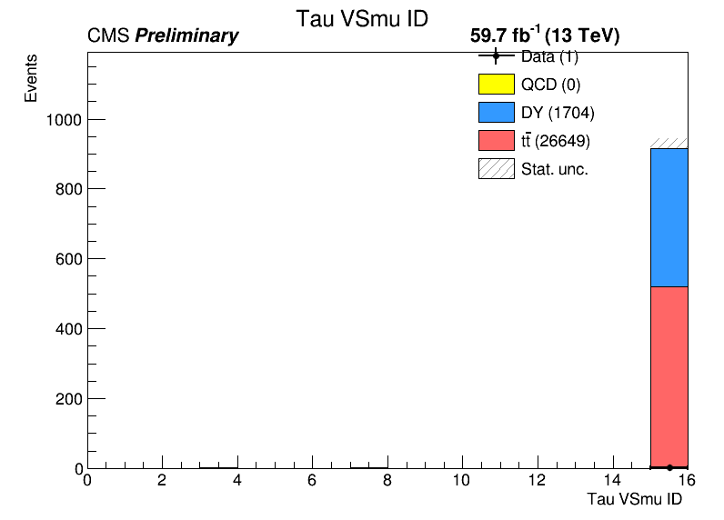
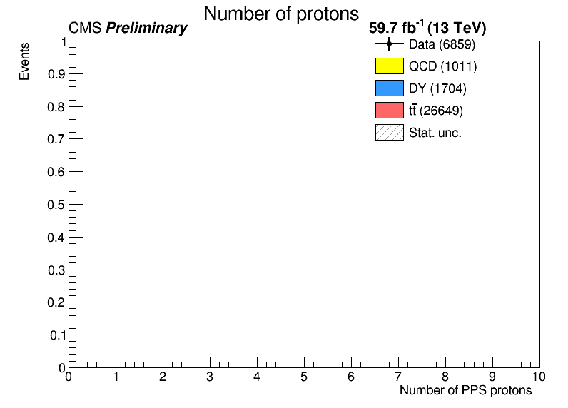
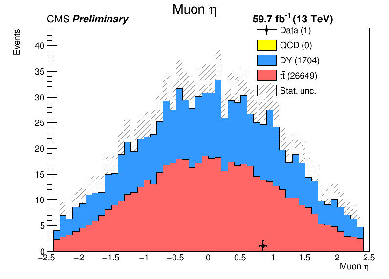
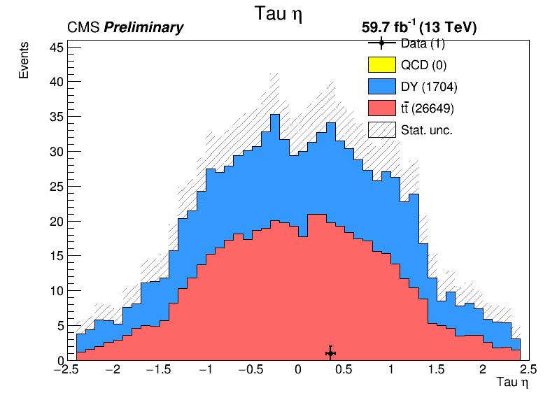
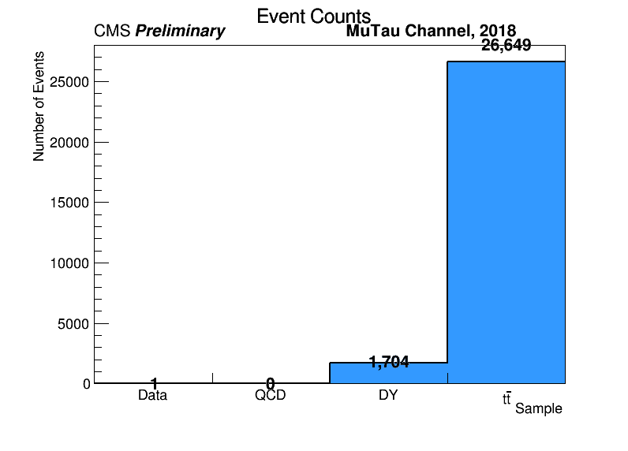
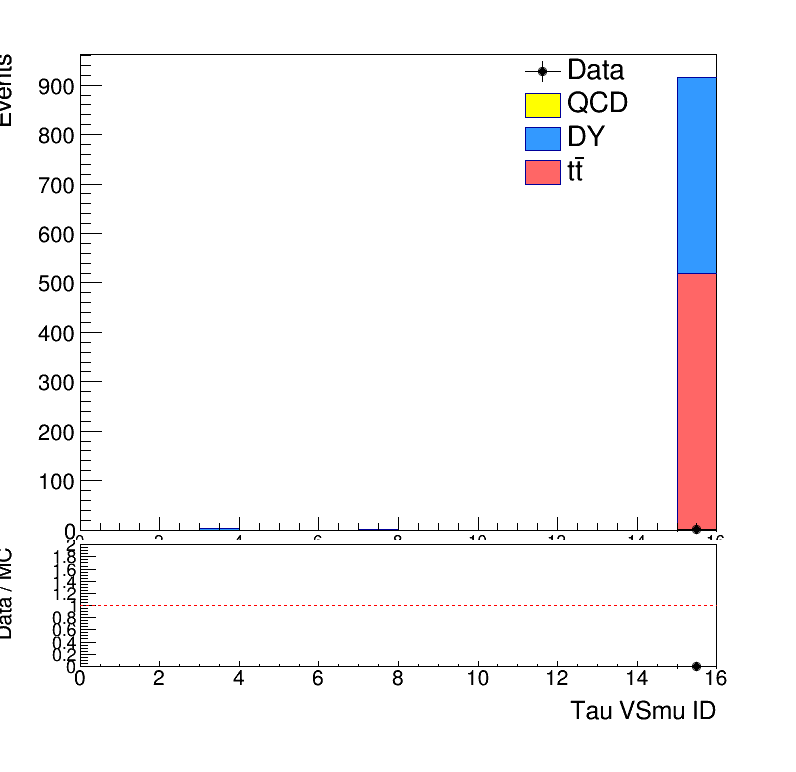

# MuTau Analysis: Data/QCD Event Count Issue


---

## Slide 1: The Problem

### Observation
- **Data events: 1,708** 
- **QCD events: 234**
- Both at approximately **50% of expected values**


---

## Slide 2: When Did This Start?

### Processing Change
Changed from **artificial pileup protons** → **real proton data**

**Old method (like DY/ttjets):**
```
Process events → Add artificial protons (100% get protons)
```

**New method (Data/QCD):**
```
Process events → Use real protons from detector (16.9% have protons)
```

**Expected impact:** ~6x reduction (100% → 16.9%)

**Observed impact:** ~2x reduction


---

## Slide 3: Diagnostic Results - Event Flow

### One typical file (1M events):

```
Raw NanoAOD:              1,023,514 events
After lumi + HLT:         1,023,514 ✓
Has protons (both arms):    172,895 (16.9%) ✓
+ Muon ID:                  138,903 (80% pass) ✓
+ Tau ID cuts:                   65 (99.95% REJECTEd) ✗
+ pT cuts:                        1
+ Eta cuts:                       1

Final: 1 Data event, 0 QCD events per file
```

**99.95% rejection at Tau ID step!**

---

## Slide 4: Root Cause - Tau VSmu Distribution

### Tau ID Requirements:
- **tau_id1 (VSjet):** > 63 → 83% pass ✓
- **tau_id2 (VSe):** > 7 → 85% pass ✓
- **tau_id3 (VSmu):** > 1 → **2.2% pass** ✗

### VSmu Acceptance:

| VSmu Value | Events | Percentage |
|------------|--------|------------|
| = 0 (fails) | 991,842 | 96.91% |
| > 0 (has some score) | 31,672 | 3.09% |
| > 1 (current cut) | 22,479 | **2.20%** |

**Only 3% of taus have ANY VSmu discrimination**

---

## Slide 5: Why Is VSmu So Low?

### Checked Raw NanoAOD:

```
Row 6,  Tau[1]: pT=30.6,  VSmu=15 ✓
Row 11, Tau[0]: pT=37.0,  VSmu=15 ✓
Row 14, Tau[0]: pT=36.6,  VSmu=0  ✗
Row 14, Tau[1]: pT=27.9,  VSmu=15 ✓
Row 14, Tau[2]: pT=26.2,  VSmu=15 ✓
Row 16, Tau[0]: pT=100.7, VSmu=1  ✓
Row 16, Tau[1]: pT=41.8,  VSmu=15 ✓
```

**In raw NanoAOD: ~10-15% of taus have VSmu > 0** ✓

**In our fase0 output: Only 3% have VSmu > 0** ✗

**What causes the difference?**

---

## Slide 6: The Bug - Wrong Tau Selection

### Current Fase0 Logic:
```python
.Define("tau_pt", "Tau_pt[0]")    # Always picks the first tau
.Define("tau_id3", "Tau_idDeepTau2017v2p1VSmu[0]")
```

**[0] = Highest pT tau** (not best quality!) -> only first tau

### Example (Row 14 from NanoAOD):
```
Tau[0]: pT=36.6 GeV, VSmu=0  ← PICKED (highest pT, bad quality)
Tau[1]: pT=27.9 GeV, VSmu=15 ← IGNORED (lower pT, good quality)
Tau[2]: pT=26.2 GeV, VSmu=15 ← IGNORED (lower pT, good quality)
```

**In MuTau channel with real muon present:**
- Highest pT "tau" is often a misidentified muon or jet
- Real taus are at lower pT
- **It looks like the code picks the wrong tau**

---

## Slide 7: Diagnostic Plots - tau_id3 (VSmu)



**Expected:** Data and MC should have similar VSmu distributions

**If we're picking wrong taus:** Data will be concentrated at VSmu=0

---

## Slide 8: Diagnostic Plots - Number of Protons



**Check:** Are proton distributions similar between Data and MC?

---

## Slide 9: Diagnostic Plots - Muon Eta



**Check:** Are kinematic distributions similar? (rules out geometric issues)

---

## Slide 10: Diagnostic Plots - Tau Eta



**Check:** Do we lose events in certain eta regions?

---

## Slide 11: Diagnostic Plots - Event Counts



**Visual confirmation:** Data and QCD much lower than expected

---

## Slide 12: Diagnostic Plots - Data/MC Ratio



**If ratio varies with VSmu:** Confirms tau selection is the issue


---

## Slide 14: Solution and expected improvement

### Solution: 
- what is the standard for selecting taus?

### Current:
```
VSmu acceptance: 3%
Data: 1,708 events
QCD: 234 events
Data < MC ✗
```

### After Fix (Expected):
```
VSmu acceptance: 10-15% (3-5x better)
Data: ~5,000-8,000 events
QCD: ~700-1,200 events
Data ≥ MC ✓
```

**Remove debugging weight=2.0** (no longer needed)

---

## Slide 15

**MuTau channel has a real muon in the event**

**Tau VSmu (Tau vs Muon discriminator):**
- Designed to reject taus that look like muons
- In MuTau events, muon presence confuses reconstruction
- Highest pT "tau" candidate is often:
  - The real muon misreconstructed as tau → VSmu = 0
  - A jet near the muon → VSmu = 0
  - A fake tau → VSmu = 0

**Real taus:**
- Well separated from muon (delta_R)
- Often at lower pT than fakes
- Have good VSmu scores (VSmu ≥ 1)

**By always picking [0] (highest pT), we are selecting fakes**

---

## Slide 16: Comparison with Old C++ Analysis

### Old C++ (nanotry_data.cpp):

```cpp
.Filter([](const vector<float>& aMu){
    return !aMu.empty() && aMu[0] >= 1.f;  // VSmu filter
  }, {"tau_id_antimu"});
```

Applied VSmu filter on [0], but:
- Input was from `"analyzer/ntp1"` (pre-processed) 
- Likely already had tau selection/ordering different from raw NanoAOD
- Or MC-based where tau[0] ordering was different

### Our New Python Processing:

- Starts from **raw NanoAOD**
- Tau[0] = highest pT (physics-agnostic ordering)
- Need to **explicitly select best quality tau**

---


## Slide 19: Summary

### Problem:
- Data/QCD at 50% of expected values
- 99.95% rejection at Tau ID (VSmu) step
- Data < MC 

### Root Cause:
- Fase0 picks highest pT tau (tau[0])
- Real taus at lower pT are ignored
- Only 3% acceptance instead of 10-15%

### Solution:
- Select best quality tau (not just highest pT)
- Prioritize VSmu score
- Expected improvement: 3-5x more events
- Data will be ≥ MC ✓

---

## Slide 20: Questions?

### Key Takeaways:


2. **The fix** : change tau selection logic

3. **Expected outcome:** Event counts increase 3-5x, Data ≥ MC


### Next Step:
Implement changes