# tt-analysis

## Check point commit -> BEFORE saving the proton related variables in the real data samples

# Plots
- Made with plot_m_new.cpp
- samples used are:
    - DY_2018_UL_MuTau_nano_merged_pileup_protons.root
    - ttjets_2018_UL_MuTau_nano_merged_pileup_protons.root
    - QCD_2018_UL_MuTau_nano_merged_pileup_protons.root
    - Data_2018_UL_MuTau_nano_merged_pileup_protons.root
    - MuTau_sinal_SM_2018_july.root -> signal file
- The processing for these files is the same as done in original analysis;
- For the samples where the proton related variables are saved from the beginning the number of events **should be the same**
    - this was done because adding pileup protons to real data was not the most correct procedure

### Plots with proton-requirements for data only
|           |   | |
:-------------------------:|:-------------------------:|:-------------------------:
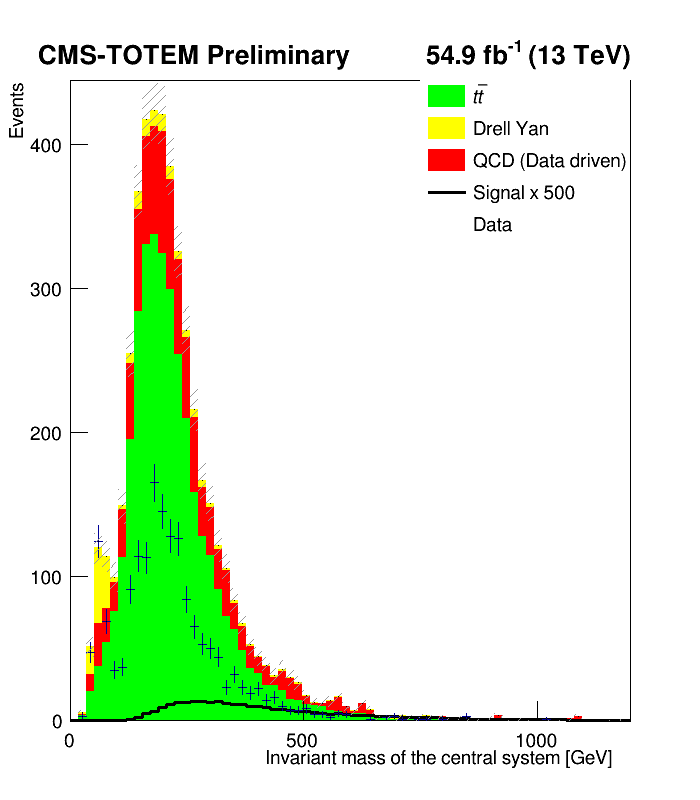  |  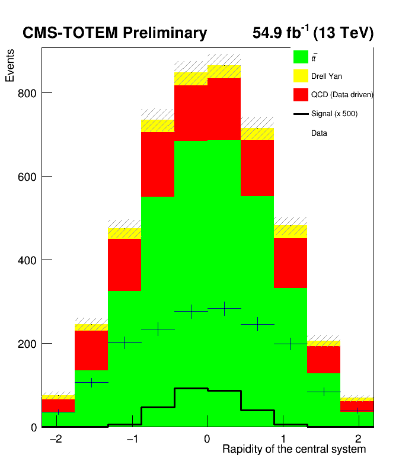 | 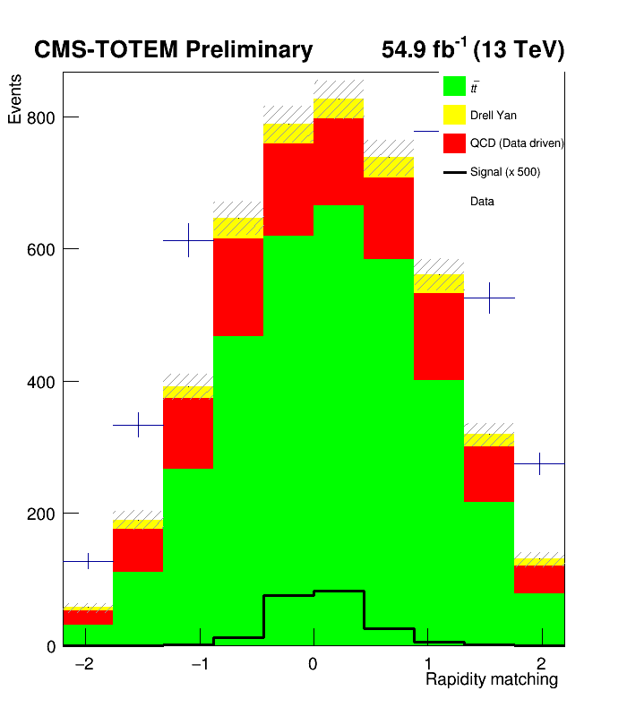|
||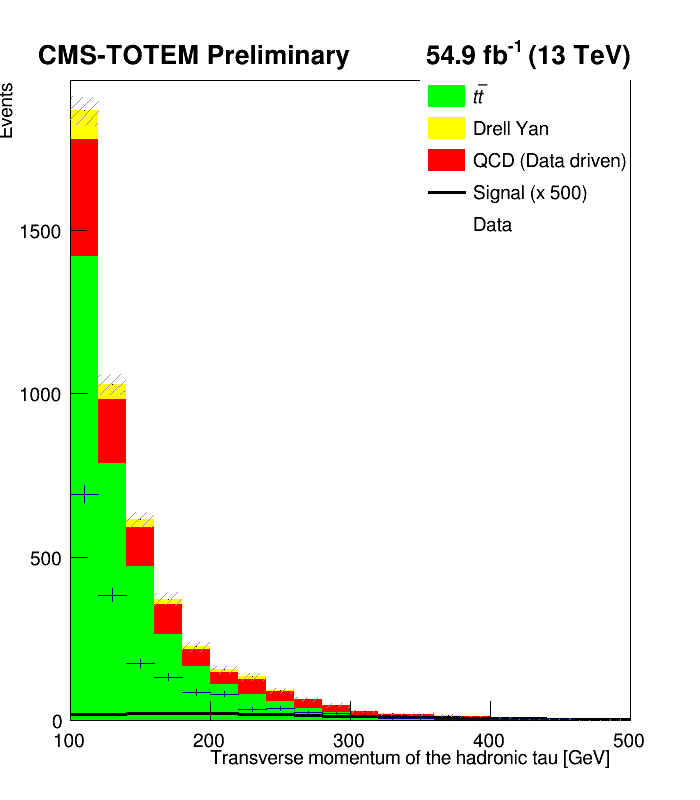| |
|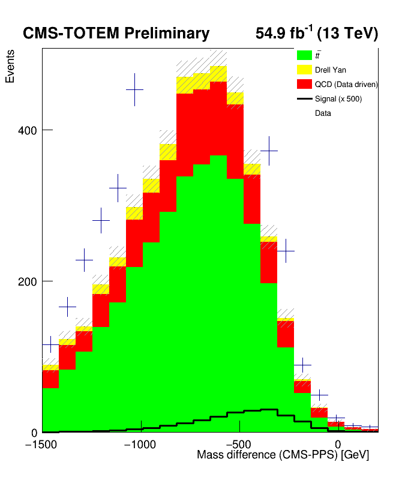||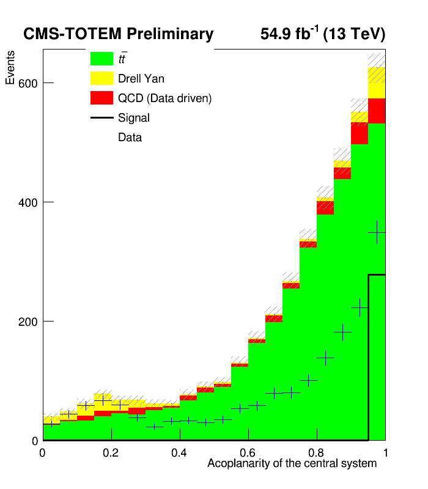|
||||

### Plots with proton-requirements for data and qcd samples
|           |   | |
:-------------------------:|:-------------------------:|:-------------------------:
  |   | |
||| |
||||
||||


### In these plots there are no proton requirements applied
|           |   | |
:-------------------------:|:-------------------------:|:-------------------------:
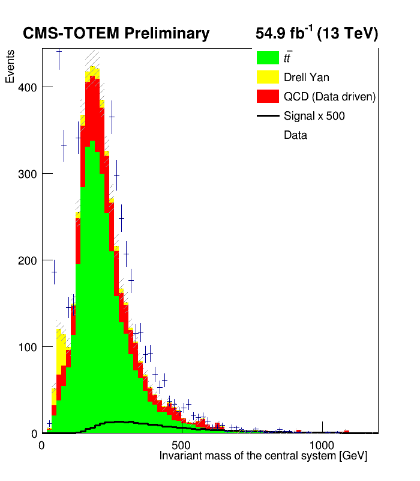  |  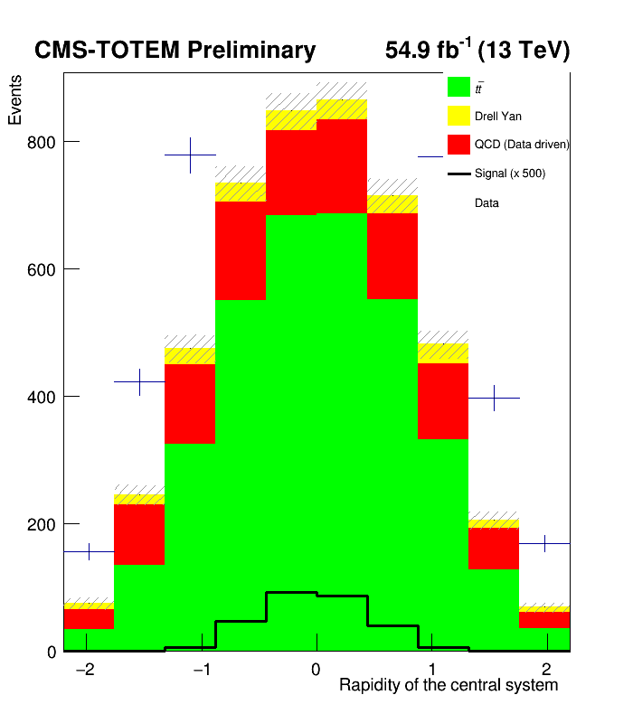 | 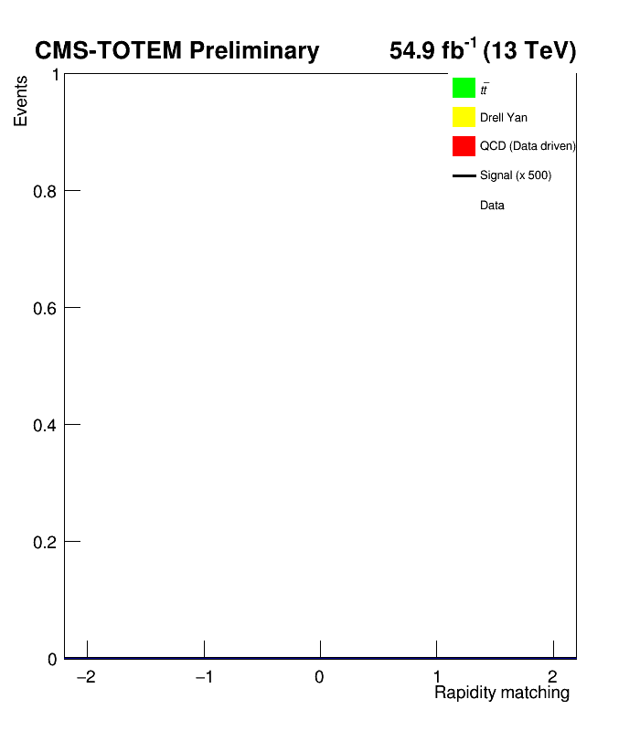|
|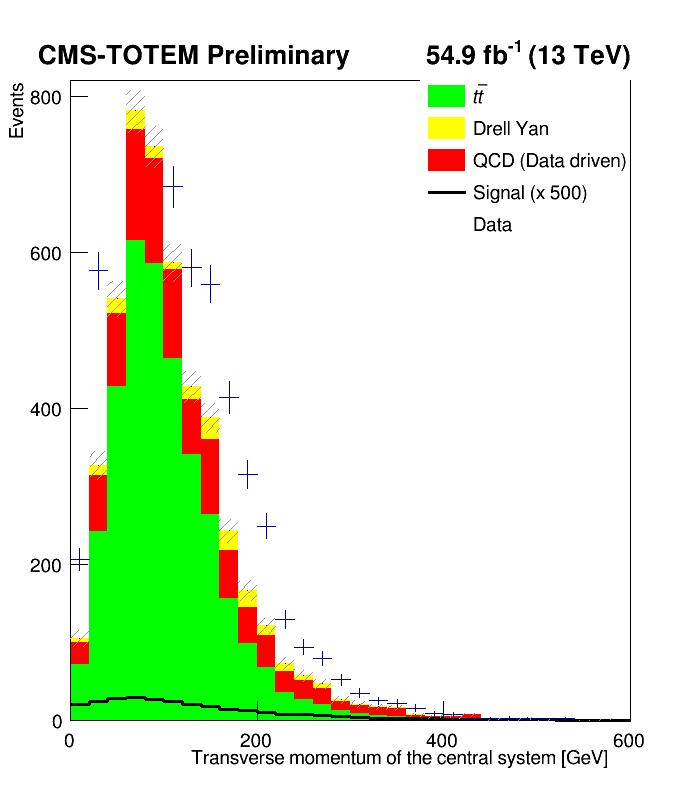|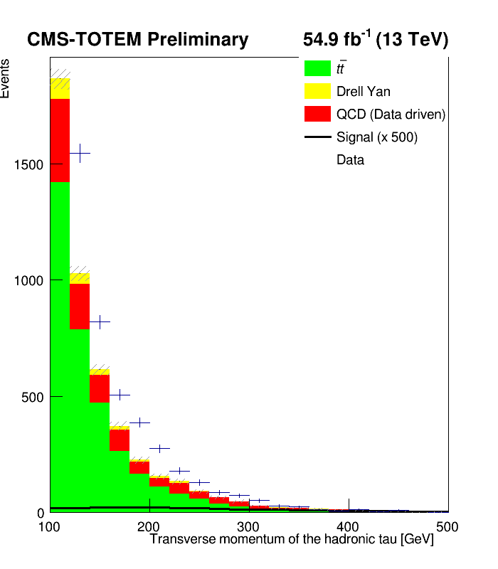| |
|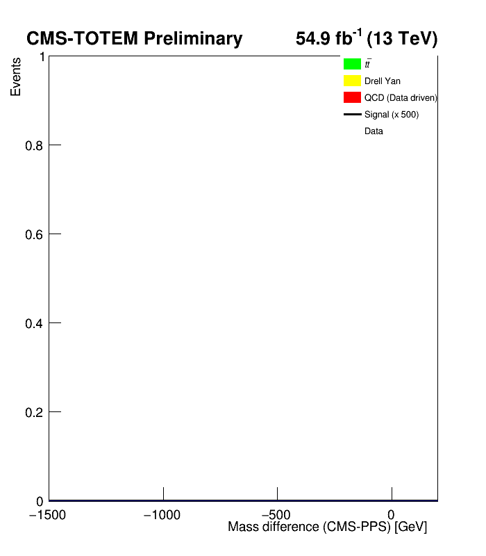||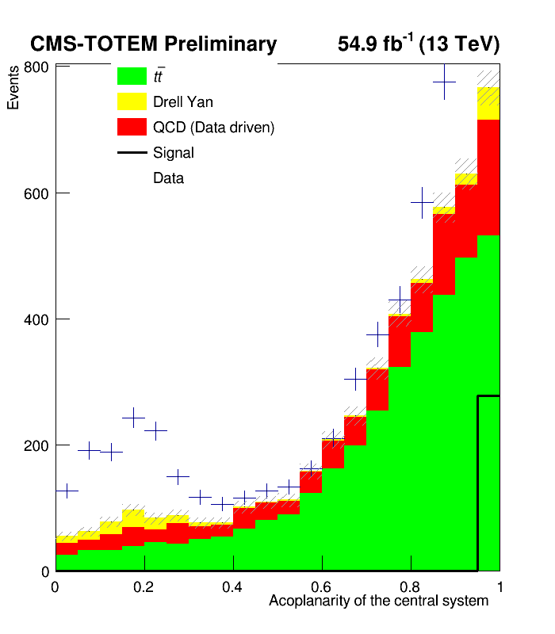|
|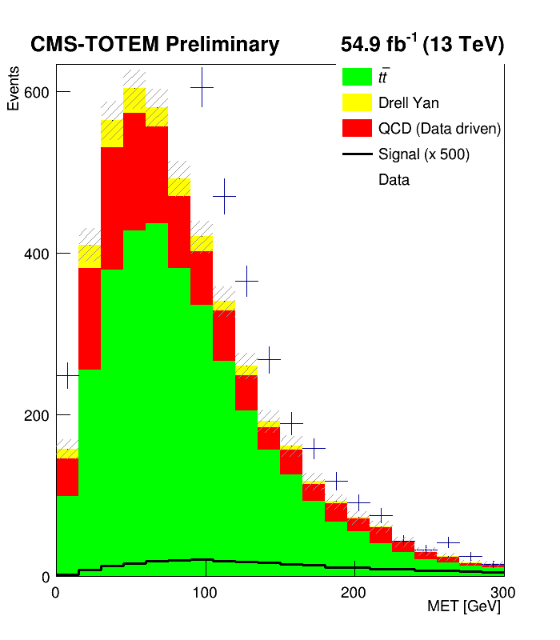|||

## Cuts applied
## MuTau Channel

| Category / Cut        | ttjets           | dy              | qcd             | data            |
|-----------------------|------------------|------------------|------------------|------------------|
| **FASE0**             | 1 tau, 1 muon    | 1 tau, 1 muon    | 1 tau, 1 muon    | 1 tau, 1 muon    |
| Double_medium         |                  |                  |                  |                  |
| Iso_Mu24              | ✓                | ✓                | ✓                | ✓                |
| Ele32_WpTight         |                  |                  |                  |                  |
| Electron_             |                  |                  |               |               |
| lumi filtering        |                  |                  | ✓                 |  ✓                |
| **FASE1**             |                  |                  |                  |                  |
| tau id1               | >63              | >63              | >63              | >63              |
| tau id2               | >7               | >7               | >7               | >7               |
| tau id3               | >1               | >1               | >1               | >1               |
| tau pt                | >100             | >100             | >100             | >100             |
| mu id                 | ≥3               | ≥3               | ≥3               | ≥3               |
| mu pt                 | >35              | >35              | >35              | >35              |
| ele id                |                  |                  |                  |                  |
| ele pt                |                  |                  |                  |                  |
| delta R               | >0.4             | >0.4             | >0.4             | >0.4             |
| eta                   | <2.4             | <2.4             | <2.4             | <2.4             |
| charge signs          | opposite         | opposite         | same             | opposite         |
| scaling factors       | ✓                | ✓                |                  |                  |
| valid jet and MET info | ✓              | ✓                |                  |                  |

# Proton selection
### 1. Proton Type Selection (lines 108-123)
The code exclusively uses multiRP (multi-Roman Pot) protons rather than single RP protons. This is evident from:
The filter checks nproton_multi == 0 and rejects events with no multiRP protons
MultiRP protons provide better reconstruction quality as they use hits from multiple detector stations
### 2. Two-Arm Requirement (lines 112-122)
The fundamental selection criterion:
// Find largest xi proton in each arm
```
bool has_arm0 = false;
bool has_arm1 = false;

for (unsigned int i = 0; i < proton_multi_arm.size(); i++) {
    if (proton_multi_arm[i] == 0) has_arm0 = true;
    if (proton_multi_arm[i] == 1) has_arm1 = true;
}
```

// Require at least one proton in each arm
```return has_arm0 && has_arm1;```
### Logic:
- Loop through all multiRP protons in the event
- Check which arm (0 or 1) each proton belongs to
- Only accept events with at least one proton in BOTH arms
- This ensures detection of forward protons on both sides of the interaction point, characteristic of central exclusive production


### 3. Proton Selection Strategy (lines 125-146)
When multiple protons are detected in the same arm, the code selects the proton with the largest ξ (xi) value: ***For Arm 0***:
```
double max_xi = -1.0;
for (unsigned int i = 0; i < proton_multi_arm.size(); i++) {
    if (proton_multi_arm[i] == 0 && proton_multi_xi[i] > max_xi) {
        max_xi = proton_multi_xi[i];
    }
}
```
***For Arm 1***: (same logic applied to arm 1) Why select largest ξ?
ξ (xi) represents the fractional momentum loss of the proton: ξ = 1 - (p_final/p_initial)
Larger ξ means more momentum was lost in the interaction
This typically corresponds to the primary scattered proton from the hard interaction
Smaller ξ values might be pile-up protons or secondary interactions

### 4. Output Variables (lines 81-82)

Two new columns are added to the output:
selected_xi_arm0: The ξ value of the selected proton in arm 0
selected_xi_arm1: The ξ value of the selected proton in arm 1
These allow downstream analysis to use a single, well-defined proton per arm rather than dealing with multiple candidates.


--- 

## Nr of events


|       |Starting sample| Phase0 | Phase1 |
| ------|---------------|--------|--------|
| Data **|984,127,247|698,931,141|1,708|
|QCD **|984,127,247|698,931,141|234|
| Data|984,127,247|19,698|6,859|
|QCD|984,127,247|19,698|1,011|
|ttjets|304,895,029|42,500,241|26,649|
|DY|195,510,810|41,388,654|1,704|
|signal|299,979|NA|13,893|

** Is the samples that save the proton related variables instead of adding pileup protons later. 

### --> Looks like the issue is the change in code to save proton related variables in phase1 

----

### DONE: running phase0 (had to re-do because I ran the wrong script)

```
# PHASE0
python3 fase0_data_mutau.py -> saved new samples to 
/eos/user/m/mblancco/samples_2018_mutau/fase0_mutau_proton_vars/Data_2018_UL_skimmed_MuTau_nano...

#PHASE1
```

### Variables saved:
-nProton_multiRP
-nProton_singleRP
-Proton_multiRP_xi
-Proton_multiRP_arm
-Proton_multiRP_t
-Proton_multiRP_thetaX
-Proton_multiRP_thetaY
-Proton_multiRP_time
-Proton_multiRP_timeUnc
-Proton_singleRP_x


### TODO: run phase1 for qcd and data separately  

